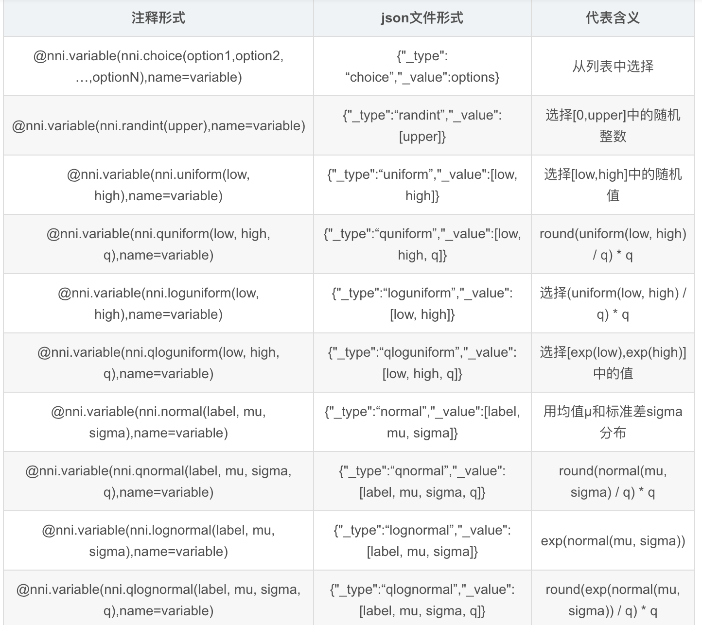
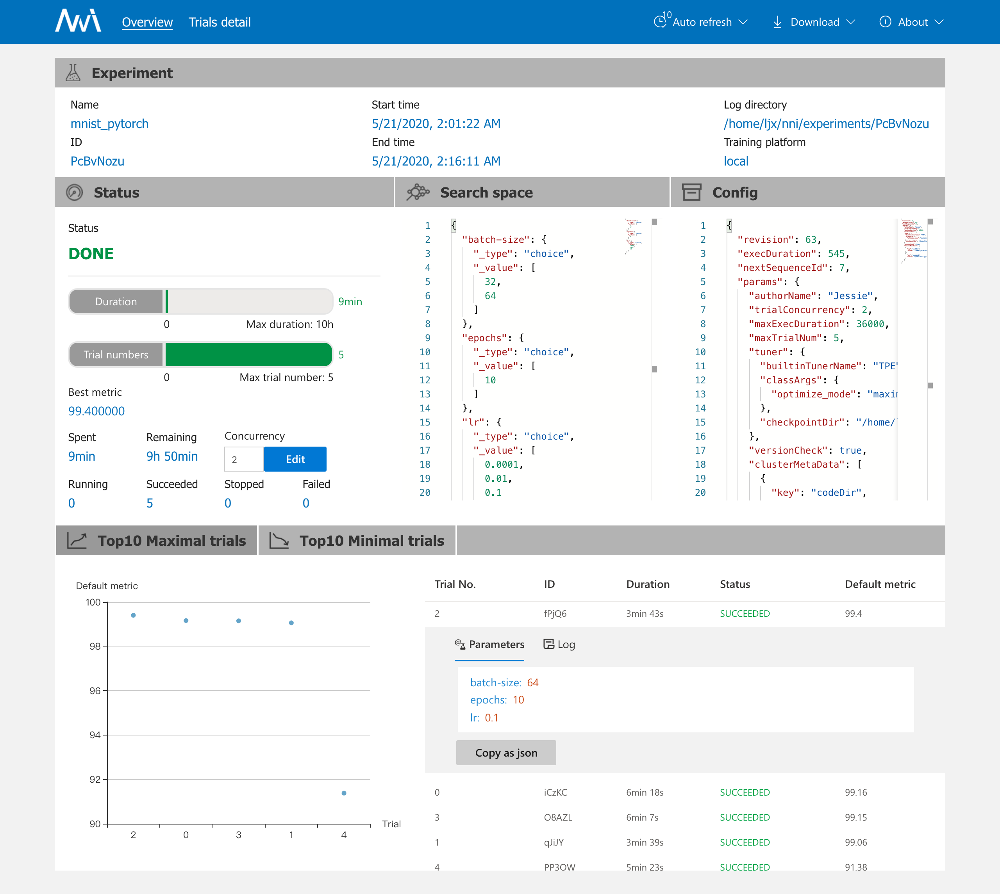
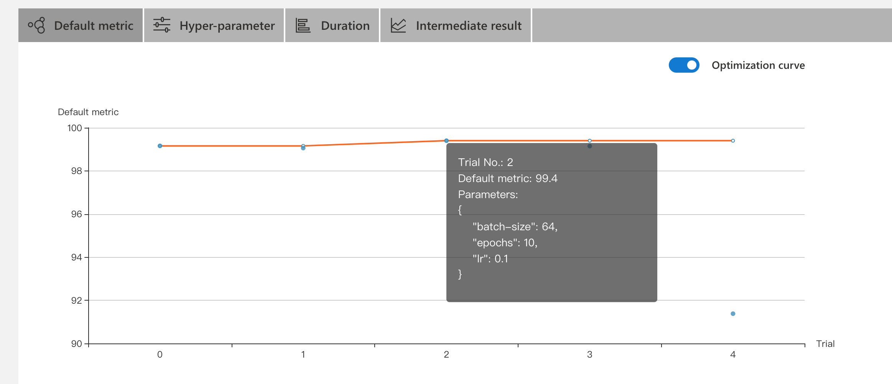
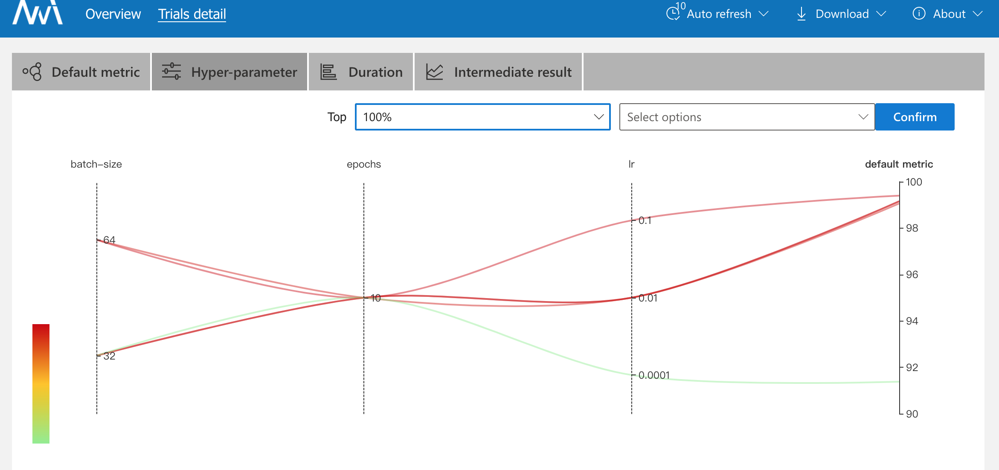
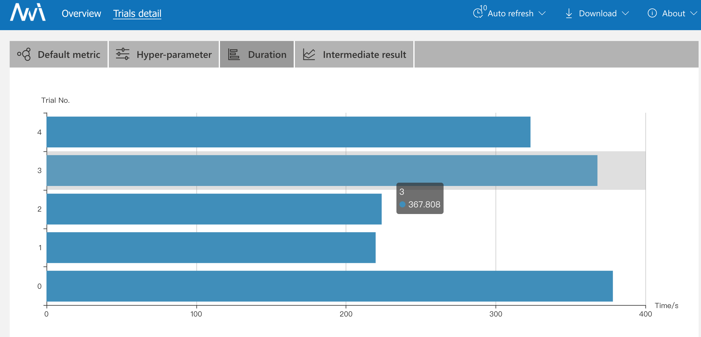
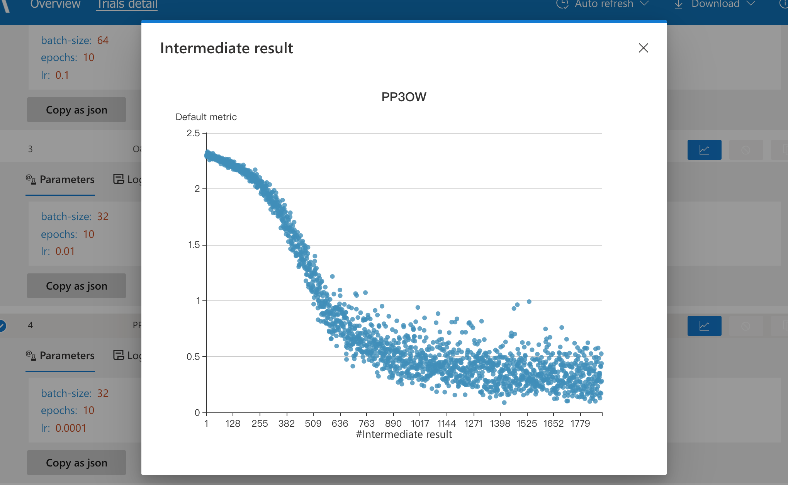

# NNI入门

## 安装

##### 系统环境

​		Ubuntu 16.04

##### 通过pip命令安装NNI（或可通过源码安装）

 		先决条件：tensorflow，pytorch，python>=3.5

```bash
# 代码使用conda虚拟环境，登陆服务器后先激活虚拟环境
conda activate nni

# 安装nni
python3 -m pip install --upgrade nni

# 克隆源代码下载示例
git clone  https://github.com/Microsoft/nni.git 
```


## 使用

使用NNI 内置的 Tuner/Assessor 和训练平台来搜索最好的超参组合以及神经网络结构的三个步骤：

> 第一步：定义搜索空间(search_space.json文件)
>
> 第二步：改动模型代码(main.py文件)
>
> 第三步：定义Experiment配置(config.yml文件)


本次示例代码是从pytorch官网下载的mnist，结合NNI内置样例，自行添加NNI元素所做的一次试验。详细代码分析见代码注释。以下是对search_space.json、main.py、config.yml三个文件关于如何添加NNI元素的一些分析说明。

##### 1.search_space.json文件——定义搜索空间

这里可以定义超参数和搜索范围，可以根据自己的需要随意调整。

搜索空间类型有很多种，常用的有uniform，choice，其他还有randint，normal，quniform，loguniform，qloguniform，qnormal，lognormal，qlognormal。

```json
{"_type": "choice", "_value": options}
# dropout_rate":{"_type":"choice","_value":[0.5, 0.9]}的结果为0.5或者0.9

{"_type": "uniform", "_value": [low, high]}
# 变量是 low 和 high 之间均匀分布的值。
# 当优化时，此变量值会在两侧区间内。

{"_type": "quniform", "_value": [low, high, q]}
# 从low开始到high结束，步长为q。
# 如{"_type": "quniform", "_value": [0, 10, 2]}的结果为0,2,4,6,8,10

{"_type": "normal", "_value": [mu, sigma]}
# 变量值为实数，且为正态分布，均值为 mu，标准方差为 sigma。 优化时，此变量不受约束。

{"_type": "randint", "_value": [lower, upper]}
# 从 lower (包含) 到 upper (不包含) 中选择一个随机整数。

```


**定义搜索空间还有一种方式：无侵入的代码注释方式。**这种方式通过在代码中对其变量加入注释行的方式定义变量的取值范围和取值方式，而不对代码本身做出修改，不改变代码本来的功能；NNI兼容已有代码，通过注释方式支持 NNI 后，代码还可以单独运行。

```
==========================use annotation example=================================

@nni.get_next_parameter()  //从tuner中获取参数
@nni.variable(nni.choice(2,3,5,7),name=self.conv_size)  //变量定义
@nni.report_intermediate_result(test_acc)  //报告中间结果
@nni.report_final_result(test_acc)  //报告最终结果
@nni.function_choice(max_pool(h_conv1, self.pool_size),avg_pool(h_conv1, self.pool_size),name=max_pool) //函数选择
```

以下列出二者对比：




##### 2.main.py文件——修改代码

在实验代码中引入nni包，并以几行代码加入nni的参数传递和结果回传即可将nni与实验代码结合起来。

```python
# 引入nni
import nni


"""
1.
设置参数自动更新。
NOTE：params是字典类型的变量
"""
# 从HPO tuner中获得一组搜索空间中的超参数
RECEIVED_PARAMS= nni.get_next_parameter() 
# 打印查看RECEIVED_PARAMS变量的内容和格式，也可方便debug
print(RECEIVED_PARAMS)
#将每次获取的参数记录到日志中
logger.info("Received params:\n", RECEIVED_PARAMS)
#_logger.debug(RECEIVED_PARAMS)


"""
2.
向nni报告我们的结果：
（1）report_intermediate_result报告中间结果
（2）report_intermediate_result报告最终结果

如果test_acc是准确率，那config.yml中的optimize_mode就选maximize。如果这里的test_acc如果是loss，
那config.yml中的optimize_mode就选minimize，或可填其他训练的指标
NOTE：报告结果都是数字，一般选择float类型
"""
# report_intermediate_result是汇报中间结果，一般可以设置每个epoch报告一次
nni.report_intermediate_result(test_acc)
# report_intermediate_result汇报的中间结果或可以从log中取,如：
"""
def on_epoch_end(self, epoch, logs=None):
        # Reports intermediate accuracy to NNI framework
        # TensorFlow 2.0 API reference claims the key is `val_acc`, but in fact it's `val_accuracy`
        if 'val_acc' in logs:
            nni.report_intermediate_result(logs['val_acc'])
        else:
            nni.report_intermediate_result(logs['val_accuracy'])
"""


# report_final_result是汇报最终结果，可以是报告last accuracy或best accuracy， 也可以汇报loss等
loss, accuracy = model.evaluate(x_test, y_test, verbose=0)
nni.report_final_result(accuracy)# send final accuracy to NNI tuner and web UI
```


##### 3.config.yml文件——配置文件

通过yml配置文件来定义实验， 配置文件中包含实验的基础信息、训练平台的选择、搜索空间的使用注释选择、协调器的选择和训练任务的配置等。

示例：

```yaml
authorName: NNI Example
experimentName: MNIST TF v2.x
trialConcurrency: 1
maxExecDuration: 1h
maxTrialNum: 10
trainingServicePlatform: local  # choices: local, remote, pai,kubeflow, frameworkcontroller
searchSpacePath: search_space.json
useAnnotation: false 
tuner:
    builtinTunerName: TPE   # choices: TPE, Random, Anneal, Evolution, BatchTuner, MetisTuner,
                            #  GPTuner, SMAC (SMAC should be installed through nnictl)
    classArgs:
        optimize_mode: maximize  # choices: maximize, minimize
trial:
  command: python3 mnist.py  
  codeDir: .  # 指定Trial文件的目录
  gpuNum: 0


```

一般需要更改的参数有command，maxExecDuration，trialConcurrency，gpuNum，optimize_mode，tuner。

1. command是指定运行Trial的命令（mnist.py可改为自己的main.py或train.py等主程序）。

2. maxExecDuration是整个NNI自动调参的时间（注意不是一次训练所需要的最大时间），如：用一个gpu跑，要训练10种不同的参数，每次训练都要2小时，这个值就设置为20h。

3. **trialConcurrency**指可同时运行的 trial 的数量，即**trail的并发数**，需要根据自己的GPU数量设置，而不是gpuNum定义的数量。因为一个trail代表一次调参的过程，理解为用一种超参数在运行mnist.py，**并发数设为x，就有x个trainer在训练**！

4. useAnnotation指使用 Annotation 分析 Trial 代码并生成搜索空间。如果 **useAnnotation** =true，searchSpacePath （指定搜索空间文件的路径，此文件必须在运行 nnictl 的本机）字段会被删除。

   关于NNI Annotation : https://nni.readthedocs.io/zh/latest/Tutorial/AnnotationSpec.html

   如何实现NNI Annotation : https://nni.readthedocs.io/zh/latest/TrialExample/Trials.html#nni-annotation

5. builtinTunerName选择何种调优算法进行超参调优。各调优算法的使用场景：https://nni.readthedocs.io/zh/latest/Tuner/BuiltinTuner.html

6. **gpuNum**指定了运行 Trial 进程的 GPU 数量。这里是**1个trail所需要的gpu个数**，而不是整个nni调参所需要的gpu个数。对于大型任务，单独训练一次需要N个GPU的话，这个值就设置为N；如果单次训练，一个GPU就足够，就把值设置为1。

   **最后需要的GPU总数为trialConcurrency\*gpuNum，即 trail的个数\*每个trail需要的gpu个数**

7. optimize_mode对应着优化的方向，有最大和最小两种方式。如果为 'maximize'，表示 Tuner 会试着最大化指标。 如果为 'minimize'，表示 Tuner 的目标是将指标最小化。

8. **tuner：**可以使用NNI内置的tuner算法，也可以**自定义tuner（在Task1.3.1中有示例）**。以下是NNI内置tuner的一些使用场景分析（**有待补充**）。

   ​		**TPE算法**: Tree-structured Parzen Estimator (TPE)基于序列模型的优化(SMBO)方法，适用于多种场景，在计算资源有限仅能进行少量实验时，经验表明其效能优于random search。这种方法通过依次构建基于历史计算来近似超参数性能，然后模型基于新的超参数进行测试。

     **Random Search算法：**随机搜索在不了解超参数的先验分布时表现良好，通过可以使用随机搜索的结果作为baseline，这种搜索方式适用于每次实验占用的时间较少且计算资源充足的情况。

     **Anneal算法：**退火算法适用于每次实验占用的时间较少且计算资源充足的情况，或者搜索空间的变量可能来自于某些先验分布时使用。简单的退火算法先进行先验采样，随着时间推移越来越接近观察到的最佳采样点。

     **Naive Evolution算法：**进化算法对计算资源的要求较高且需要庞大的计算量来避免达到局部最优解，它适用于含有评估算法且训练时长较短的情况，还适用于训练代码支持权重转移的情况。进化算法先随机初始化，然后逐代更迭，通过对每一代进行更改超参数、增删层数等变异方式获得下一代，每一次选择更好的一代。

     **SMAC算法：**SMAC算法适用于计算资源优先且大多数超参数为离散值的情况，它基于序列模型的优化(SMBO算法)，它适应以前的高斯随机过程模型，并引入随机森林的模型来处理分类参数。

     **Batch tuner算法：**Batch tuner算法适用于已经确定了要尝试的搜索空间，用户为代码提供几种超参数选择的配置，它通过批量实验尝试不同的配置空间。

     **Grid Search算法：**网格搜索通过搜索空间文件中定义的超参数空间的手动指定子集执行穷举搜索，它适用于当搜索空间比较小的情况，此时穷举遍历是可行的。

     **Hyperband算法：**Hyperband使用有限的资源探索尽可能多的配置，并找出有希望获得最终结果的配置。基本思想是生成许多配置，通过少数几步运行产生的中间结果选出最有希望的配置，然后进一步训练那些有希望的配置以得到最终结果。这种算法在中间结果的表现在某种程度能够反应最终结果的性能。

     **Network Morphism算法：**网络态射适用于计算机视觉领域且有自己的数据集的情况下寻找较优的网络结构，它具有了自动搜索深度学习模型架构的功能。每个子网络都从其父网络继承知识，并变形为不同类型的网络，包括深度，宽度和skip-connection的变化。接下来，它使用历史架构和度量对估计子网络的价值，最后选择最有前途的一个网络训练。

     **Metis Tuner算法：**Metis是微软研究的一种tuner算法，可以在训练中提供当前预测的最佳配置和下一次实验的配置建议，会给出建议是否需要对某一特定超参数进行重新采样。


## 实验启动

进入项目配置文件目录，在命令行输入：`nnictl create -c config.yml -p 8090`，成功启动：

```bash
(nni) ljx@cad68-PowerEdge-T630:~/NNIProj/Task1.1$ nnictl create -c config.yml -p 8080
INFO: expand searchSpacePath: search_space.json to /home/ljx/NNIProj/Task1.1/search_space.json 
INFO: expand codeDir: . to /home/ljx/NNIProj/Task1.1/. 
INFO: Starting restful server...
INFO: Successfully started Restful server!
INFO: Setting local config...
INFO: Successfully set local config!
INFO: Starting experiment...
INFO: Successfully started experiment!
------------------------------------------------------------------------------------
The experiment id is PcBvNozu
The Web UI urls are: http://127.0.0.1:8080   http://10.108.209.96:8080   http://172.17.0.1:8080   http://172.30.99.0:8080
------------------------------------------------------------------------------------

You can use these commands to get more information about the experiment
------------------------------------------------------------------------------------
         commands                       description
1. nnictl experiment show        show the information of experiments
2. nnictl trial ls               list all of trial jobs
3. nnictl top                    monitor the status of running experiments
4. nnictl log stderr             show stderr log content
5. nnictl log stdout             show stdout log content
6. nnictl stop                   stop an experiment
7. nnictl trial kill             kill a trial job by id
8. nnictl --help                 get help information about nnictl
------------------------------------------------------------------------------------
Command reference document https://nni.readthedocs.io/en/latest/Tutorial/Nnictl.html
------------------------------------------------------------------------------------

```

## WebUI查看结果

Overview页：

通过search space可以看出本次Experiment共有6种超参组合，但我在config.yml中设置了Max trial number为5，所以当试验通过TPE超参搜索算法搜索到5种它认为最好的参数组合后，Experiment便停止运行。

可以看出，trial并发数设置为2，表明当gpu空闲可用时，可同时运行两个trial。

Top10 Maximal/Minimal trials对每个trial的最终试验结果进行排序，下图可以看出第2个trial的表现最好，最好的预测精度达到了99.4%，同时也可以查看该trial的参数组合和log地址。




Detail页：

报告的中间结果为训练过程中的loss，可以看到图中蓝色的那条曲线（对应学习率0.0001）loss收敛没有其他几个trial的loss收敛快，其实是由于学习率设置的不好。


Default metric:




Hyper-parameter:超参组合，可以通过Top来筛选以便更清晰的查看一些比较好的超参组合。

下图可以看出参数组合{"batch_size":64,"epochs":10,"lr":0.1}表现最好。




Duration：每一个trial的训练时间




Trial jobs --> Intermediate result

Trial jobs部分可查看单个trial的中间结果。

