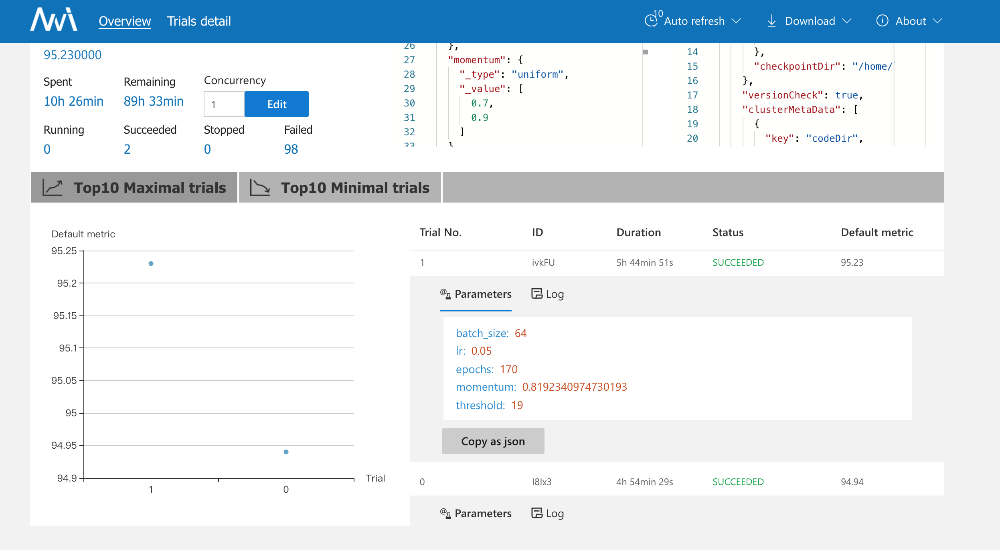
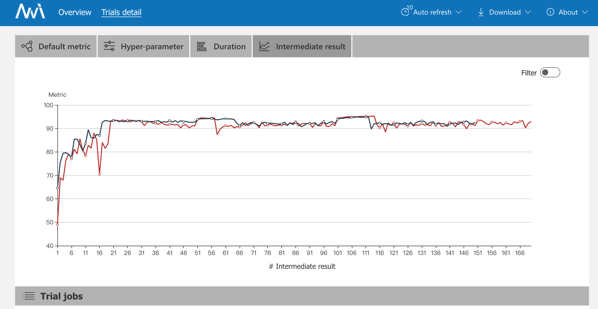
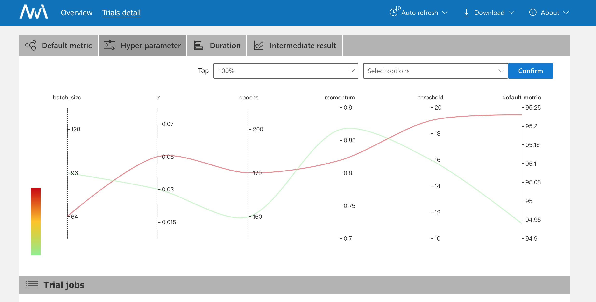

本次实验在原来代码的基础上，以cifar10为基础，对googlenet模型进行训练，寻求更有参数。。

由于时间原因以及实验室服务器资源有限，只进行了两个trail就终止了训练，以下是两个trail的训练结果，达到了95%的精确度。






**改进**

代码中只进行了简单的学习率衰减的设定：

```python
if epoch==args['threshold']:
        optimizer = optim.SGD(net.parameters(), lr=args['lr'], momentum=0.9, weight_decay=5e-4)
    if epoch % 50 == 0:
        lr = args['lr']*(0.1**(epoch//50))
        optimizer = optim.SGD(net.parameters(), lr=lr, momentum=0.9, weight_decay=5e-4)
```

从nni报告的中间结果（测试精确度）可以看出，该部分还可以做进一步的优化，例如使用pytorch提供的学习率衰减策略进行优化。

下一步将使用NAS搜索更优的网络架构模型，进一步提高测试精确度。

【参数threshold的解释：本来代码中使用SGD和Adadelta两种优化算法进行训练，threshold值是当搜索算法搜索Adadelta作为优化算法的时候，训练前期使用Adadelta，当epoch>threshold值是optimizer转换成SGD继续训练。后来经过几次trail发现基于Googlenet训练时全程使用SGD优化算法表现更好。】

googlenet_V2A_SE.py文件是在googlenet网络模型的基础上添加了SE模块。

【保持更新...】