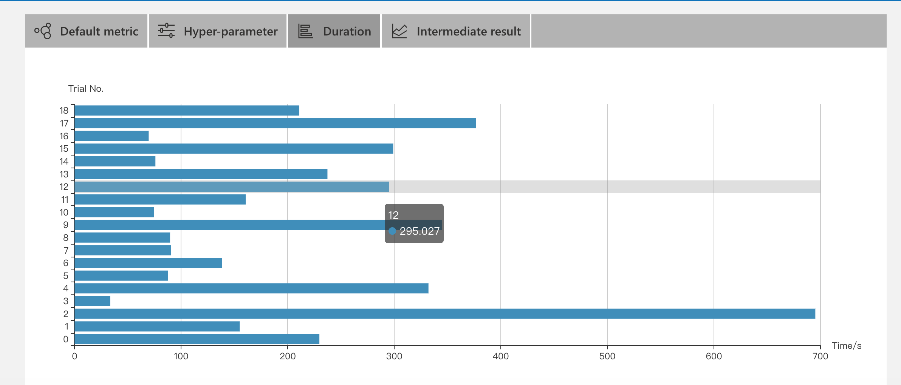
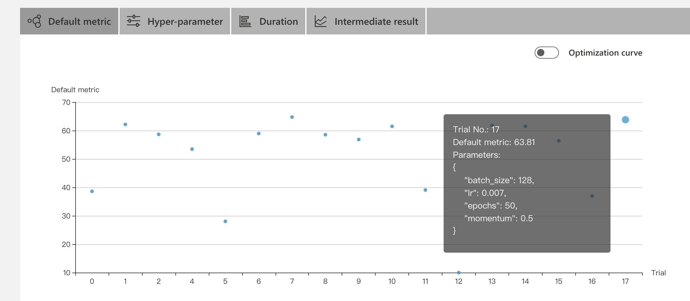

首先，按照pytorch官网示例Train a classifier，训练一个普通分类器，当训练过程中设置：

​	batch_size = 4

​	lr = 0.001

​	epoch = 2

​	优化器SGD的momentum = 0.9

此时，使用10000测试集图像测试的结果为accuracy = 55.630%


本次任务是在源代码的基础上加入NNI元素。


## 代码及实现

#### 主程序完整代码：train.py
NOTE: 在train_optim.py程序代码中做了尝试，实现搜索不同的optimizer，包括：SGD，Adadelta，Adagrad，Adam，Adamax几个优化算法，但训练结果显示SGD算法表现最好，这里不过多介绍。

##### 1.从Tuner获取参数：`RCV_CONFIG = nni.get_next_parameter()`

##### 2.报告中间结果——Training的loss

**nni.report_intermediate_result()**

```python
def train(args):
    global trainloader
    global testloader
    global net
    global criterion
    global optimizer

    for epoch in range(args['epochs']):
        train_loss = 0.0
        for batch_idx,data in enumerate(trainloader,0):
        		# get the inputs; data is a list of [inputs, targets]
            inputs, targets = data[0].to(device), data[1].to(device)
            optimizer.zero_grad()
            outputs = net(inputs)
            # 计算loss
            loss = criterion(outputs,targets)
            # BP
            loss.backward()
            # optimize
            optimizer.step()

            #  打印
            train_loss +=loss.item()
            if batch_idx % 2000 ==1999:
                print('[%d,%5d] loss:%.3f'%(epoch+1,batch_idx+1,train_loss /2000) )
                nni.report_intermediate_result(train_loss /2000)
                train_loss =0.0

    print('Finished Training')
    return
```

##### 3.报告最终结果——Testing的accuracy

**nni.report_final_result()**

```python
def test():
    global trainloader
    global testloader
    global net
    global criterion
    global optimizer

    #net.eval()
    correct = 0
    total = 0
    with torch.no_grad():
        for data in testloader:
            inputs, targets = data[0].to(device), data[1].to(device)
            outputs = net(inputs)
            #loss = criterion(outputs, targets)

            #_, predicted = outputs.max(1)
            _, predicted = torch.max(outputs.data, 1)
            total += targets.size(0)
            correct += (predicted == targets).sum().item()
                   
    
    acc = 100.*correct/total
    print('Acc: %.3f%% (%d/%d)'% (acc, correct, total))
    
    return acc
  
# ...
acc= test()
nni.report_final_result(acc)
  
```

#### 配置文件：config.py

其中，使用TPE作为超参搜索算法，设置trial并发数为2，且一个trial使用两个gpu进行运算。

#### 定义搜索空间：search_space.py

其中，定义了batch_size,lr,epochs,momentum四个参数的搜索范围。

## 实验启动

进入项目配置文件目录，在命令行输入：`nnictl create -c config.yml -p 8090`，成功启动：

```bash
(nni) ljx@cad68-PowerEdge-T630:~/NNIProj/Task1.2/Task1.2.1$ nnictl create -c config.yml -p 8090
INFO: expand searchSpacePath: search_space.json to /home/ljx/NNIProj/Task1.2/Task1.2.1/search_space.json 
INFO: expand codeDir: . to /home/ljx/NNIProj/Task1.2/Task1.2.1/. 
INFO: Starting restful server...
INFO: Successfully started Restful server!
INFO: Setting local config...
INFO: Successfully set local config!
INFO: Starting experiment...
INFO: Successfully started experiment!
------------------------------------------------------------------------------------
The experiment id is B9rprefq
The Web UI urls are: http://127.0.0.1:8090   http://10.108.209.96:8090   http://172.17.0.1:8081   http://172.30.99.0:8090
------------------------------------------------------------------------------------

You can use these commands to get more information about the experiment
------------------------------------------------------------------------------------
         commands                       description
1. nnictl experiment show        show the information of experiments
2. nnictl trial ls               list all of trial jobs
3. nnictl top                    monitor the status of running experiments
4. nnictl log stderr             show stderr log content
5. nnictl log stdout             show stdout log content
6. nnictl stop                   stop an experiment
7. nnictl trial kill             kill a trial job by id
8. nnictl --help                 get help information about nnictl
------------------------------------------------------------------------------------
Command reference document https://nni.readthedocs.io/en/latest/Tutorial/Nnictl.html
------------------------------------------------------------------------------------

```

## WebUI查看结果

本次Experiment使用TPE超参搜索算法选取了24种组合（config.yml文件中设置maxTrialNum的值），以下是训练结果的overview：


由于在gpu上运行试验时，需要保证gpu空闲。我在训练时，实验室服务器上4块gpu有3块在使用中，所以我调整了trialConcurrency和gpuNum均为1。

由上面的概览图可以看出，测试集上的最高精度达到了64.74，大大超过了示例代码的预测结果。下面我们看一下trial的详细信息。

在Hyper-parameter中筛选排名前20%的超参组合，可以直观的看到，目前表现最好的超参组合是：

{"batch_size":64, "lr":0.014, "epochs":10, "momentum":0.9}

Trial jobs中可以看到每一个trial参数组合的详细信息和以及对应的log目录地址。


Intermediate result可以看到NNI报告的中间结果。我的中间结果输出的是训练过程中的loss，这样可以清楚的看到loss的收敛速度，对调节learning rate的搜索范围由一定的帮助。鼠标放在节点上可以看到每一个Trial的详细信息。如下图：


Trial Duration可以看出每次实验运行的时间。



Default metric(trial结果的不同表现状态)




最终参数的选择：
首先根据Hyper Parameter的结果，挑选出实验结果较好的几个参数组合，然后再看Trial Duration中的结果，挑选运行时间较短的，并且考虑Intermediate中loss收敛的速度。