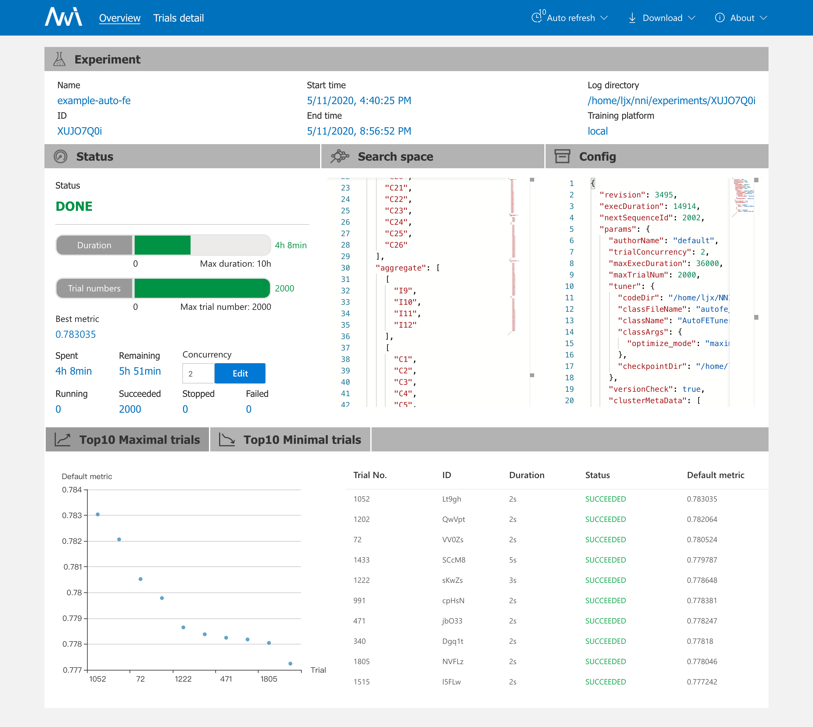
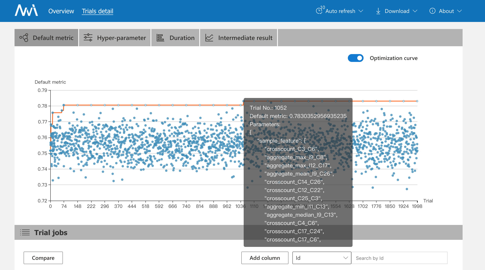
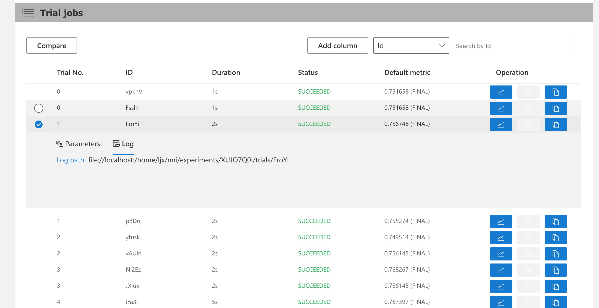
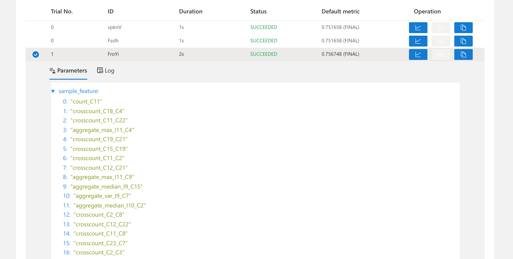

# 体验NNI中的特征工程

特征工程是应用经典机器学习算法的前置步骤，通过特征工程，能让机器学习过程更快得到较好的结果。

#### NNI中Auto-FE的特点

1.支持基于梯度和决策树的自动特征选择算法，同时提供了扩展其他算法的接口。

2.NNI支持的GradientFeatureSelector和GBDTSelector特征选择器只适用于结构化数据（不适用于图像、语音和文本数据）。

3.这些Selector仅用于特征选择。如果需要：

​	 1) 在特征选择时，通过 NNI 生成高阶的组合特征；

​	 2) 使用分布式资源。

#### **NNI的Auto-FE示例**

NNI把 Auto-FE 拆分成 exploration 和 selection 两个模块。 exploration 主要是特征衍生和交叉，selection 是如何做特征筛选。在该auto-fe示例中主要使用了梯度提升框架 LightGBM（Light Gradient Boosting Machine）做特征selection(main.py代码分析中已标注出)。

而对于特征 Exploration，具体特征怎么交叉，哪一列和哪一列交叉，每一列特征用什么方式衍生，可以通过 search_space. json 这个文件控制，定制生成的高阶组合features。

## 代码分析

##### **1.  ./tabular_automl_NNI/search_space. json** 

**如何在search_space.json文件中定制搜索空间呢？**

对于功能派生，NNI 提供了许多可自动生成新功能的操作：

**count**：传统的统计，统计一些数据的出现频率

**target**：特征和目标列的一些映射特征

**embedding**：把特征看成句子，用 *word2vector* 的方式制作向量

**crosscount**：特征间除法，有点类似CTR

**aggregete**：特征的 min/max/var/mean

**nunique**：统计唯一特征的数量。

**histsta**：特征存储桶的统计信息，如直方图统计信息。


search_space. json 示例代码及分析如下：

```json
# 特征 Exploration
{
    "count":[
        "C1","C2","C3","C4","C5","C6","C7","C8","C9","C10",
        "C11","C12","C13","C14","C15","C16","C17","C18","C19",
        "C20","C21","C22","C23","C24","C25","C26"
    ],  # 搜索列名称 {"C1"、"..."，"C26"} 上的频率编码
    "aggregate":[
        ["I9","I10","I11","I12"], # 数值列可用average，sum，min，max进行探索
        [
            "C1","C2","C3","C4","C5","C6","C7","C8","C9","C10",
            "C11","C12","C13","C14","C15","C16","C17","C18","C19",
            "C20","C21","C22","C23","C24","C25","C26"
        ] # 选择一个数字列和一个类别列聚合成新的组合特征列
    ],
    "crosscount":[
        [
            "C1","C2","C3","C4","C5","C6","C7","C8","C9","C10",
            "C11","C12","C13","C14","C15","C16","C17","C18","C19",
            "C20","C21","C22","C23","C24","C25","C26"
        ], 
        [
            "C1","C2","C3","C4","C5","C6","C7","C8","C9","C10",
            "C11","C12","C13","C14","C15","C16","C17","C18","C19",
            "C20","C21","C22","C23","C24","C25","C26"
        ] # 在列 {"C1",...,"C26"} x {"C1",...,"C26"} 上定义交叉频率编码（交叉维度的值计数）方法
    ]
}
```

自我理解：

count：作用在类别列(CAT)上。统计类别列（CAT）出现的频率，将训练集上的所有类别替换为统计的每个类别出现的频数。频数大表明特征更重要。count encoding也称frequency encoding。

crosscount：作用在几个类别列(CAT)上，实现特征交叉计数，即多维度的count encoding。在某些任务中，例如点击率（CTR），特征交叉非常重要。

aggregate：可作用在类别列(CAT)也可作用在数值列(NUM)上。我们按实例对数据进行分组，一行表示一个实例，按aggregate操作进行特征分组的关键是确定特征的聚合功能。对于数字特征，可以进行*average*，*sum*，*min*，*max*函数操作来聚合，类别列则比较复杂。


##### **2.  ./tabular_automl_NNI/config.yml**

在该配置文件中重点分析自定义tuner，其他配置的解析在体验文档中有详细注明。

**通过自定义tuner实现调优算法的步骤：**

**(1) 继承 Tuner  (./tabular_automl_NNI/autofe_tuner.py文件)**

```python
# autofe_tuner.py
from nni.tuner import Tuner
logger = logging.getLogger('autofe-tuner')
class AutoFETuner(Tuner):
    #任何需要传入 __init__ 构造函数的参数都需要声明在config.yml中的classArgs 字段中，但是因为这里的参数设置了默认值，可以不写
    def __init__(self, optimize_mode = 'maximize', feature_percent = 0.6):
      ...
```


**(2) 实现 receive_trial_result 和 generate_parameter 函数  (./tabular_automl_NNI/autofe_tuner.py文件)**

​        `generate_parameters` 函数返回的 `your_parameters`，会被NNI SDK打包为json。 然后SDK会将 json对象解包给Trial进程。因此，Trial进程会在调用 API `nni.get_next_parameter()`时收到来自Tuner的完全相同的 `your_parameters`。

​		`receive_trial_result` 从输入中会接收 `parameter_id, parameters, value` 参数。  一个Trial进程结束后的返回值（通常是某个指标），通过调用 API `nni.report_final_result()` 返回给 Tuner。如： `nni.report_final_result(0.97)`。 而 Tuner 的 `receive_trial_result` 函数会收到如下结果：

```
parameter_id = xxxx
parameters = 一次trial调用nni.get_next_parameter()得到的your_parameters
value = 0.97
```

 本例示例代码如下：

```python
# autofe_tuner.py
from nni.tuner import Tuner
class AutoFETuner(Tuner):
    def __init__(self, optimize_mode = 'maximize', feature_percent = 0.6):
        ...
    def generate_parameters(self, parameter_id, **kwargs):
    		'''
    		返回 Trial 的超参组合的序列化对象
    		parameter_id: int
    		'''
    		# 代码实现
        ... 
    		return your_parameters   	  
    def receive_trial_result(self, parameter_id, parameters, value, **kwargs):
    		'''
    		接收 Trial 的最终结果。
    		parameter_id: int
   	 		parameters: 'generate_parameters()' 所创建的对象
    		value: Trial 的最终指标结果
    		'''
    		# 实现代码
    		...
        # 日志记录
    		logger.info('receive trial result is:\n')
        logger.info(str(parameters))
        logger.info(str(reward)) # reward是处理过的value
        return
```


**(3) 在 Experiment 的 YAML 文件中配置好自定义的 Tuner(config.yml文件)**

```yml
#config.yml
authorName: default
experimentName: example-auto-fe
trialConcurrency: 1
maxExecDuration: 10h
maxTrialNum: 2000
#choice: local, remote
trainingServicePlatform: local
searchSpacePath: search_space.json
#choice: true, false
useAnnotation: false

 # 自定义tuner
tuner:  
#指定自定义 Tuner 类的文件位置，NNI 需要定位到自定义的 Tuner 类，并实例化它
  codeDir: .
  classFileName: autofe_tuner.py
  
  #AutoFETuner类中实现了generate_parameters、receive_trial_result等函数方法，以及定义search_space中count、aggregate、crosscount等的规则
  className: AutoFETuner 
  
  #任何传入 __init__ 构造函数的参数都需要声明在 classArgs 字段中，目的是将参数值传给 __init__ 构造函数
  classArgs:
    optimize_mode: maximize
    
trial:
  command: python3 main.py
  codeDir: .
  gpuNum: 0
```


##### **3.   ./tabular_automl_NNI/main.py**

```python
import nni
import logging
import numpy as np
import pandas as pd
import json
from fe_util import *
from model import *

logger = logging.getLogger('auto-fe-examples')

if __name__ == '__main__':
    file_name = 'train.tiny.csv'
    target_name = 'Label'
    id_index = 'Id'

    # 获取tuning的参数
    RECEIVED_PARAMS = nni.get_next_parameter()
    #将每次获取的参数记录到日志中
    logger.info("Received params:\n", RECEIVED_PARAMS)
    
    # list is a column_name generate from tuner
    df = pd.read_csv(file_name)
    #sample_feature是search_space中使用count、crosscount、aggregate创建的新特征
    if 'sample_feature' in RECEIVED_PARAMS.keys():
        sample_col = RECEIVED_PARAMS['sample_feature']
    else:
        sample_col = []
    
    # 特征Selection：使用lightGBM可以很容易计算出每个特征对于结果的影响，从而进行特征筛选）
    # note：如果下游是逻辑回归这种线性算法，筛选出来的特征是否具备普适性？
    # raw feaure + sample_feature
    df = name2feature(df, sample_col, target_name)
    '''
    lgb_model_train()函数定义在model.py中
    找出重要特征feature_imp的伪代码：
    feature_score =  0.3* ( 100*gain/gain.sum() ) + 0.7 * ( 100*split/split.sum() )
    feature_score = feature_score /feature_score.sum()
    feature_imp = feature_imp.sort_values('feature_score',ascending=False)
    其中，'split'表示'结果包含特征在模型中使用的次数'，'gain'表示'结果包含此特征拆分出的总收益'。
    '''
    feature_imp, val_score = lgb_model_train(df,  _epoch = 1000, target_name = target_name, id_index = id_index)
    
    
    # 报告最终结果
    nni.report_final_result({
        "default":val_score, #由roc_auc_score()函数计算出的AUC的值
        "feature_importance":feature_imp
    })
```


## 实验启动

进入项目配置文件目录，在命令行输入：`nnictl create -c config.yml -p 8080`，成功启动：

```bash
(nni) ljx@cad68-PowerEdge-T630:~/NNIProj/Task1.3/Task1.3.1/tabular_automl_NNI$ nnictl create -c config.yml -p 8080
INFO: expand searchSpacePath: search_space.json to /home/ljx/NNIProj/Task1.3/Task1.3.1/tabular_automl_NNI/search_space.json 
INFO: expand codeDir: . to /home/ljx/NNIProj/Task1.3/Task1.3.1/tabular_automl_NNI/. 
INFO: expand codeDir: . to /home/ljx/NNIProj/Task1.3/Task1.3.1/tabular_automl_NNI/. 
INFO: Starting restful server...
INFO: Successfully started Restful server!
INFO: Setting local config...
INFO: Successfully set local config!
INFO: Starting experiment...
INFO: Successfully started experiment!
------------------------------------------------------------------------------------
The experiment id is zTgwI9EJ
The Web UI urls are: http://127.0.0.1:8080   http://10.108.209.96:8080   http://172.17.0.1:8080   http://172.30.99.0:8080
------------------------------------------------------------------------------------

You can use these commands to get more information about the experiment
------------------------------------------------------------------------------------
         commands                       description
1. nnictl experiment show        show the information of experiments
2. nnictl trial ls               list all of trial jobs
3. nnictl top                    monitor the status of running experiments
4. nnictl log stderr             show stderr log content
5. nnictl log stdout             show stdout log content
6. nnictl stop                   stop an experiment
7. nnictl trial kill             kill a trial job by id
8. nnictl --help                 get help information about nnictl
------------------------------------------------------------------------------------
Command reference document https://nni.readthedocs.io/en/latest/Tutorial/Nnictl.html
------------------------------------------------------------------------------------

```

## WebUI查看结果

在Top10 Maximal Trials中可以清楚的看到表现结果最好的前10个trial，点开可以查看每一个trial的详细信息，包括该Trial的高阶特征组合。其实，在Overview页的Top10 Maximal/Minimal trials、Detail页的Default metric和Trial jobs部分都可以查看trial的详细信息。







详情页也可查看trial的细节信息和log，Parameters显示每一次trial的高阶特征组合，log则显示每一个trial的log path。我觉得如果可以显示出stderr和stdout信息会更方便。




