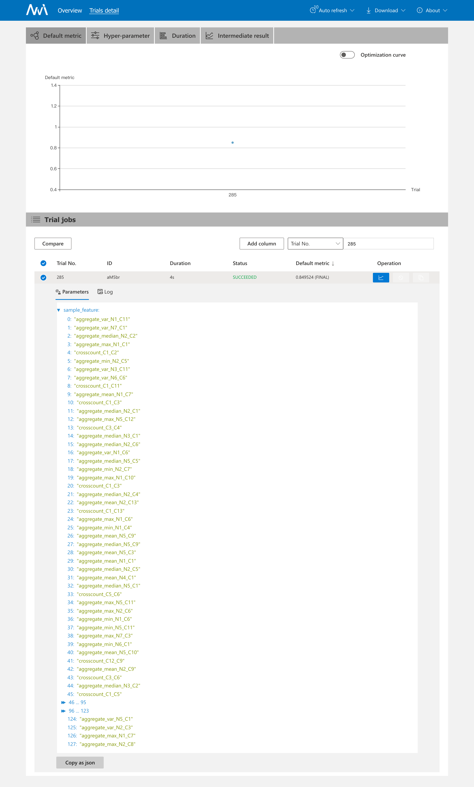

## 数据集

使用UCI提供的German credit数据集，下载地址：http://archive.ics.uci.edu/ml/datasets/statlog+(german+credit+data)

所用原始数据集：**German.data**

数据集介绍：German.doc

​	Number of Attributes german: **20 (7 numerical, 13 categorical)**


将.data数据文件转换成.csv格式的数据:

```python
import pandas as pd
#读取data文件，指定属性，sep='[\s]*'意义为匹配一个或多个空格，因为原始数据集中数据分割是两个或者多个空格
data=pd.read_table('german.data',header=None,names=['C1','N1','C2','C3','N2','C4','C5','N3','C6','C7','N4','C8','N5','C9','C10','N6','C11','N7','C12','C13','Class'],sep='[\s]*')
#生成csv文件
data.to_csv('german.csv',index=True)
```

或者是在mian.py中：

```python
if __name__ == '__main__':
    file_name = ' german.data'
    # ...代码相同...
    df = pd.read_csv(file_name, sep = '[\s]*')
    df.columns = [       
      'C1','N1','C2','C3','N2','C4','C5','N3','C6','C7','N4',
      'C8','N5','C9','C10','N6','C11','N7','C12','C13','Class'
    ]
    df['Class'] = LabelEncoder().fit_transform(df['Class'])
    # ...代码相同...
```

## Baseline auc: 0.8345

```bash
(nni) ljx@cad68-PowerEdge-T630:~/NNIProj/Task1.3/Task1.3.2$ python baseline.py 
Training until validation scores don't improve for 100 rounds
[50]    eval's auc: 0.800529
[100]   eval's auc: 0.821905
[150]   eval's auc: 0.824656
[200]   eval's auc: 0.82963
[250]   eval's auc: 0.831534
[300]   eval's auc: 0.832593
[350]   eval's auc: 0.830899
Early stopping, best iteration is:
[276]   eval's auc: 0.834497
val_score: 0.8344973544973545
```


## Automl auc: 0.8495

Overview页可以看到，第285个Trial时accuracy值最大，detail页可进一步查看其详细信息。





